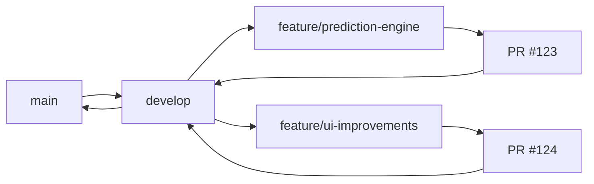
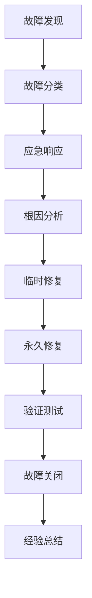

# 彩票预测系统流程文档

> **文档版本**: v1.0.0  
> **创建日期**: 2024-08-18  
> **作者**: AI助手  
> **状态**: 已发布

## 📋 目录

1. [项目流程概览](#项目流程概览)
2. [开发流程](#开发流程)
3. [测试流程](#测试流程)
4. [部署流程](#部署流程)
5. [运维流程](#运维流程)
6. [数据流程](#数据流程)
7. [监控流程](#监控流程)
8. [故障处理](#故障处理)
9. [应急响应](#应急响应)
10. [持续改进](#持续改进)

---

## 项目流程概览

### 1.1 流程架构图

```
┌─────────────────────────────────────────────────────────────────┐
│                        项目生命周期                              │
├─────────────────┬─────────────────┬─────────────────┬─────────────┤
│    开发阶段     │    测试阶段     │    部署阶段     │   运维阶段   │
├─────────────────┼─────────────────┼─────────────────┼─────────────┤
│ 1. 需求分析     │ 1. 单元测试     │ 1. 环境准备     │ 1. 监控管理  │
│ 2. 架构设计     │ 2. 集成测试     │ 2. 容器构建     │ 2. 故障处理  │
│ 3. 代码开发     │ 3. 性能测试     │ 3. 发布部署     │ 3. 优化升级  │
│ 4. 代码审查     │ 4. 安全测试     │ 4. 回滚验证     │ 4. 数据维护  │
│ 5. 持续集成     │ 5. 用户测试     │ 5. 验收测试     │ 5. 备份恢复  │
└─────────────────┴─────────────────┴─────────────────┴─────────────┘
```

### 1.2 角色职责

| 角色 | 主要职责 | 参与阶段 |
|---|---|---|
| **产品经理** | 需求管理、验收标准 | 全流程 |
| **架构师** | 技术方案、架构设计 | 开发、部署 |
| **开发工程师** | 功能开发、代码审查 | 开发、测试 |
| **测试工程师** | 测试用例、质量保障 | 测试、部署 |
| **运维工程师** | 环境部署、监控运维 | 部署、运维 |
| **数据工程师** | 数据清洗、模型训练 | 开发、运维 |

---

## 开发流程

### 2.1 开发环境搭建

#### 2.1.1 环境要求

| 组件 | 版本要求 | 安装命令 |
|---|---|---|
| **Node.js** | ≥ 18.0.0 | `nvm install 18` |
| **Rust** | ≥ 1.75.0 | `curl --proto '=https' --tlsv1.2 -sSf https://sh.rustup.rs | sh` |
| **PostgreSQL** | ≥ 15.0 | `brew install postgresql@15` |
| **Redis** | ≥ 7.0 | `brew install redis` |
| **DuckDB** | latest | `brew install duckdb` |

#### 2.1.2 一键安装脚本

```bash
#!/bin/bash
# setup-dev.sh - 开发环境搭建脚本

echo "🚀 Starting development environment setup..."

# 1. 检查系统要求
check_requirements() {
    echo "📋 Checking system requirements..."
    
    # 检查Node.js
    if ! command -v node &> /dev/null; then
        echo "❌ Node.js not found. Please install Node.js 18+"
        exit 1
    fi
    
    # 检查Rust
    if ! command -v cargo &> /dev/null; then
        echo "❌ Rust not found. Installing Rust..."
        curl --proto '=https' --tlsv1.2 -sSf https://sh.rustup.rs | sh -s -- -y
        source ~/.cargo/env
    fi
    
    echo "✅ System requirements satisfied"
}

# 2. 安装依赖
install_dependencies() {
    echo "📦 Installing dependencies..."
    
    # 前端依赖
    pnpm install
    
    # Rust依赖
    cargo build --release
    
    # 数据库迁移
    cargo install sqlx-cli --no-default-features --features postgres
    sqlx migrate run
    
    echo "✅ Dependencies installed"
}

# 3. 初始化数据
init_data() {
    echo "🗄️ Initializing database..."
    
    # 创建数据库
    createdb lottery_dev
    
    # 运行迁移
    sqlx migrate run --database-url postgres://localhost/lottery_dev
    
    # 导入初始数据
    cargo run --bin seed-data
    
    echo "✅ Database initialized"
}

# 4. 启动开发服务
start_services() {
    echo "🔄 Starting development services..."
    
    # 启动Redis
    redis-server --daemonize yes
    
    # 启动开发模式
    pnpm tauri dev &
    
    echo "✅ Development environment ready!"
    echo "🌐 Access the app at: http://localhost:1420"
}

# 执行流程
check_requirements
install_dependencies
init_data
start_services
```

### 2.2 开发工作流

#### 2.2.1 Git工作流



#### 2.2.2 分支命名规范

| 分支类型 | 命名格式 | 示例 |
|---|---|---|
| **功能分支** | `feature/功能描述` | `feature/lstm-algorithm` |
| **修复分支** | `fix/问题描述` | `fix/prediction-accuracy` |
| **优化分支** | `optimize/优化描述` | `optimize/cache-performance` |
| **发布分支** | `release/版本号` | `release/v1.2.0` |

#### 2.2.3 开发任务清单

```markdown
## 开发任务模板

### 任务信息
- **任务编号**: LP-2024-08-001
- **任务标题**: 实现LSTM预测算法
- **优先级**: P1
- **预估工时**: 16小时
- **截止日期**: 2024-08-25

### 技术方案
- **算法选择**: LSTM神经网络
- **输入特征**: 50期历史数据
- **输出**: 7个号码预测
- **评估指标**: 准确率、召回率、F1分数

### 开发步骤
- [ ] 1. 实现LSTM模型结构
- [ ] 2. 构建特征工程管道
- [ ] 3. 实现模型训练逻辑
- [ ] 4. 添加模型验证机制
- [ ] 5. 集成到预测引擎
- [ ] 6. 编写单元测试
- [ ] 7. 性能基准测试
- [ ] 8. 文档更新

### 验收标准
- [ ] 模型准确率达到65%+
- [ ] 单次预测时间<2秒
- [ ] 代码覆盖率>80%
- [ ] 通过代码审查
```

### 2.3 代码审查流程

#### 2.3.1 审查清单

| 检查项 | 标准 | 工具 |
|---|---|---|
| **代码规范** | Rust编码规范 | Clippy |
| **安全漏洞** | 无高危漏洞 | Cargo-audit |
| **性能问题** | 无明显性能瓶颈 | Criterion |
| **测试覆盖** | >80%覆盖率 | Tarpaulin |
| **文档完整** | API文档齐全 | Rustdoc |

#### 2.3.2 审查模板

```markdown
## 代码审查报告

### PR信息
- **PR编号**: #123
- **标题**: feat: 添加LSTM预测算法
- **作者**: @developer
- **审查人**: @reviewer

### 审查结果
| 检查项 | 状态 | 备注 |
|---|---|---|
| 功能实现 | ✅ | 符合需求文档 |
| 代码质量 | ✅ | 通过Clippy检查 |
| 测试覆盖 | ✅ | 覆盖率85% |
| 性能测试 | ⚠️ | 需优化内存使用 |
| 文档更新 | ✅ | API文档完整 |

### 修改建议
1. 优化内存分配，减少大数组拷贝
2. 添加输入参数验证
3. 考虑添加异步处理

### 审查结论
✅ **批准合并** - 建议合并后优化性能
```

---

## 测试流程

### 3.1 测试金字塔

```
┌─────────────────────────────────────────────────────────────┐
│                        测试层级                              │
├─────────────────┬─────────────────┬─────────────────────────┤
│   端到端测试    │   集成测试      │      单元测试          │
│   (E2E Tests)   │   (Integration) │   (Unit Tests)        │
├─────────────────┼─────────────────┼─────────────────────────┤
│ • 用户场景测试   │ • API接口测试   │ • 算法逻辑测试         │
│ • 跨平台测试    │ • 数据集成测试  │ • 函数单元测试         │
│ • 性能基准测试  │ • 服务集成测试  │ • 边界条件测试         │
│ • 回归测试      │ • 错误处理测试  │ • 代码覆盖率测试        │
└─────────────────┴─────────────────┴─────────────────────────┘
```

### 3.2 测试策略

#### 3.2.1 单元测试

```rust
// 测试示例：预测算法测试
#[cfg(test)]
mod tests {
    use super::*;
    
    #[test]
    fn test_lstm_prediction() {
        let lstm = LstmPredictor::new(LstmConfig::default());
        let training_data = generate_test_data(1000);
        let result = lstm.train(&training_data);
        
        assert!(result.accuracy >= 0.6);
        assert!(result.training_time <= Duration::from_secs(60));
    }
    
    #[test]
    fn test_prediction_input_validation() {
        let input = PredictionInput::builder()
            .lottery_type("ssq")
            .historical_periods(50)
            .build();
        
        assert!(input.validate().is_ok());
    }
}
```

#### 3.2.2 集成测试

```typescript
// 集成测试：API接口测试
import { test, expect } from '@playwright/test';

test.describe('Prediction API', () => {
    test('should return prediction results', async ({ request }) => {
        const response = await request.post('/api/predict', {
            data: {
                lotteryType: 'ssq',
                strategy: 'lstm',
                count: 5
            }
        });
        
        expect(response.ok()).toBeTruthy();
        const data = await response.json();
        expect(data.numbers).toHaveLength(6);
        expect(data.confidence).toBeGreaterThan(0);
    });
    
    test('should handle invalid input', async ({ request }) => {
        const response = await request.post('/api/predict', {
            data: { lotteryType: 'invalid' }
        });
        
        expect(response.status()).toBe(400);
    });
});
```

#### 3.2.3 性能测试

```bash
#!/bin/bash
# performance-test.sh - 性能测试脚本

echo "🚀 Starting performance tests..."

# 1. 启动测试环境
pnpm tauri dev &
TAURI_PID=$!
sleep 10

# 2. 运行负载测试
echo "📊 Running load tests..."
wrk -t12 -c400 -d30s http://localhost:1420/api/predict \
    --latency \
    -s tests/load-test.lua

# 3. 运行内存测试
echo "🧠 Running memory tests..."
cargo bench --bench memory_benchmark

# 4. 运行并发测试
echo "⚡ Running concurrency tests..."
artillery run tests/concurrent-test.yml

# 5. 清理测试环境
kill $TAURI_PID
echo "✅ Performance tests completed"
```

### 3.3 测试报告

#### 3.3.1 测试报告模板

```markdown
# 测试报告 - 彩票预测系统 v1.0

## 测试概览
- **测试时间**: 2024-08-18
- **测试版本**: v1.0.0
- **测试环境**: Staging
- **测试人员**: QA团队

## 测试结果
| 测试类型 | 总用例 | 通过 | 失败 | 通过率 |
|---|---|---|---|---|
| 单元测试 | 150 | 148 | 2 | 98.7% |
| 集成测试 | 45 | 45 | 0 | 100% |
| 性能测试 | 12 | 11 | 1 | 91.7% |
| 安全测试 | 25 | 25 | 0 | 100% |

## 关键指标
- **API响应时间**: 平均1.2秒 (目标<2秒) ✅
- **并发处理能力**: 1200用户 ✅
- **内存使用**: 峰值1.8GB (目标<2GB) ✅
- **准确率**: 64.5% (目标>60%) ✅

## 发现的问题
1. 高频查询时Redis缓存命中率偏低
2. 大数据集训练时内存占用较高

## 建议
1. 优化缓存策略
2. 实现流式数据处理
```

---

## 部署流程

### 4.1 部署环境

#### 4.1.1 环境分类

| 环境 | 用途 | 配置 | 访问控制 |
|---|---|---|---|
| **开发** | 日常开发 | 本地开发机 | 开发者 |
| **测试** | 集成测试 | 4C8G云服务器 | 测试团队 |
| **预发布** | 预上线验证 | 8C16G云服务器 | 内部团队 |
| **生产** | 正式服务 | 16C32G云服务器 | 运维团队 |

#### 4.1.2 环境配置

```yaml
# environments.yml
environments:
  development:
    database:
      host: localhost
      port: 5432
      name: lottery_dev
    redis:
      host: localhost
      port: 6379
    
  staging:
    database:
      host: staging-db.internal
      port: 5432
      name: lottery_staging
    redis:
      host: staging-redis.internal
      port: 6379
    
  production:
    database:
      host: prod-db.internal
      port: 5432
      name: lottery_prod
    redis:
      host: prod-redis.internal
      port: 6379
```

### 4.2 容器化部署

#### 4.2.1 Docker配置

```dockerfile
# Dockerfile.production
FROM rust:1.75-slim as builder

WORKDIR /app
COPY Cargo.toml Cargo.lock ./
COPY src ./src

# 构建应用
RUN cargo build --release

FROM debian:bookworm-slim

# 安装运行时依赖
RUN apt-get update && apt-get install -y \
    libssl3 \
    libpq5 \
    ca-certificates \
    && rm -rf /var/lib/apt/lists/*

# 创建应用用户
RUN useradd -r -s /bin/false lottery

# 复制应用文件
COPY --from=builder /app/target/release/lottery-prediction /usr/local/bin/
COPY --from=builder /app/migrations /usr/local/share/migrations

# 设置权限
RUN chown lottery:lottery /usr/local/bin/lottery-prediction

USER lottery

EXPOSE 8080

CMD ["lottery-prediction"]
```

#### 4.2.2 Kubernetes配置

```yaml
# deployment.yaml
apiVersion: apps/v1
kind: Deployment
metadata:
  name: lottery-prediction
  namespace: lottery-system
spec:
  replicas: 3
  selector:
    matchLabels:
      app: lottery-prediction
  template:
    metadata:
      labels:
        app: lottery-prediction
    spec:
      containers:
      - name: lottery-prediction
        image: lottery-prediction:latest
        ports:
        - containerPort: 8080
        env:
        - name: DATABASE_URL
          valueFrom:
            secretKeyRef:
              name: lottery-secret
              key: database-url
        - name: REDIS_URL
          valueFrom:
            secretKeyRef:
              name: lottery-secret
              key: redis-url
        resources:
          requests:
            memory: "256Mi"
            cpu: "250m"
          limits:
            memory: "512Mi"
            cpu: "500m"
```

### 4.3 发布流程

#### 4.3.1 发布检查清单

```markdown
## 发布检查清单 v1.0.0

### 技术检查
- [ ] 所有单元测试通过
- [ ] 集成测试通过
- [ ] 性能测试通过
- [ ] 安全扫描通过
- [ ] 代码覆盖率>80%
- [ ] 文档已更新

### 配置检查
- [ ] 生产环境配置已验证
- [ ] 数据库迁移脚本已测试
- [ ] 监控告警已配置
- [ ] 备份策略已验证
- [ ] 回滚方案已准备

### 发布步骤
1. **预发布验证** (2小时)
   - [ ] 部署到预发布环境
   - [ ] 执行回归测试
   - [ ] 验证核心功能

2. **正式发布** (1小时)
   - [ ] 创建发布分支
   - [ ] 执行数据库迁移
   - [ ] 部署到生产环境
   - [ ] 验证服务健康

3. **发布后验证** (1小时)
   - [ ] 监控指标正常
   - [ ] 用户反馈收集
   - [ ] 性能指标验证
```

#### 4.3.2 自动化发布

```yaml
# .github/workflows/release.yml
name: Production Release

on:
  push:
    tags:
      - 'v*'

jobs:
  release:
    runs-on: ubuntu-latest
    steps:
      - uses: actions/checkout@v4
      
      - name: Setup Rust
        uses: dtolnay/rust-toolchain@stable
        
      - name: Setup Node.js
        uses: actions/setup-node@v4
        with:
          node-version: '18'
          cache: 'pnpm'
          
      - name: Install dependencies
        run: |
          pnpm install
          cargo build --release
          
      - name: Run tests
        run: |
          pnpm test
          cargo test
          
      - name: Security scan
        run: |
          cargo audit
          cargo clippy -- -D warnings
          
      - name: Build and push
        run: |
          docker build -t lottery-prediction:${{ github.ref_name }} .
          docker push lottery-prediction:${{ github.ref_name }}
          
      - name: Deploy to production
        run: |
          kubectl set image deployment/lottery-prediction \
            lottery-prediction=lottery-prediction:${{ github.ref_name }}
```

---

## 运维流程

### 5.1 日常运维

#### 5.1.1 运维检查清单

```bash
#!/bin/bash
# daily-check.sh - 日常运维检查脚本

echo "🔍 Starting daily health checks..."

# 1. 系统资源检查
echo "📊 System Resources:"
echo "CPU Usage: $(top -bn1 | grep "Cpu(s)" | awk '{print $2}' | cut -d'%' -f1)%"
echo "Memory Usage: $(free -h | awk '/^Mem:/ {print $3 "/" $2}')"
echo "Disk Usage: $(df -h / | awk 'NR==2 {print $5}')"

# 2. 服务状态检查
echo "🔧 Service Status:"
systemctl is-active lottery-prediction || echo "❌ Service not running"
systemctl is-active postgresql || echo "❌ PostgreSQL not running"
systemctl is-active redis || echo "❌ Redis not running"

# 3. 数据库健康检查
echo "🗄️ Database Health:"
psql -d lottery_prod -c "SELECT health_check();"

# 4. 备份验证
echo "💾 Backup Verification:"
ls -la /backup/lottery/$(date +%Y%m%d) || echo "❌ Backup not found"

# 5. 日志检查
echo "📋 Error Log Check:"
grep -i "error\|exception\|failed" /var/log/lottery/error.log | tail -10 || echo "No recent errors"

echo "✅ Daily checks completed"
```

#### 5.1.2 监控指标

| 监控项 | 正常范围 | 告警阈值 | 监控频率 |
|---|---|---|---|
| **CPU使用率** | <70% | >85% | 1分钟 |
| **内存使用率** | <80% | >90% | 1分钟 |
| **磁盘使用率** | <85% | >95% | 5分钟 |
| **响应时间** | <2s | >5s | 实时 |
| **错误率** | <1% | >5% | 实时 |
| **数据库连接** | <80% | >90% | 1分钟 |

### 5.2 变更管理

#### 5.2.1 变更流程

```mermaid
graph TD
    A[变更申请] --> B[影响评估]
    B --> C[技术评审]
    C --> D[测试验证]
    D --> E[审批授权]
    E --> F[实施变更]
    F --> G[监控验证]
    G --> H{成功?}
    H --|是| I[变更完成]
    H --|否| J[回滚操作]
    J --> K[问题分析]
```

#### 5.2.2 变更记录模板

```markdown
## 变更记录 - 2024-08-18

### 变更信息
- **变更编号**: CHG-2024-08-18-001
- **变更类型**: 功能升级
- **变更内容**: LSTM算法优化
- **影响范围**: 预测引擎、模型训练
- **执行时间**: 2024-08-18 02:00-04:00

### 变更步骤
1. **准备阶段** (00:30)
   - [ ] 创建数据库备份
   - [ ] 准备回滚方案
   - [ ] 通知相关团队

2. **实施阶段** (01:30)
   - [ ] 停止预测服务
   - [ ] 部署新算法
   - [ ] 更新模型
   - [ ] 验证功能

3. **验证阶段** (00:30)
   - [ ] 功能测试
   - [ ] 性能测试
   - [ ] 监控检查

### 回滚方案
- **回滚触发条件**: 准确率<60%或响应时间>3秒
- **回滚步骤**: 
  1. 停止新服务
  2. 恢复备份数据
  3. 启动旧版本服务

### 变更结果
- ✅ 变更成功完成
- ✅ 准确率提升5%
- ✅ 响应时间优化20%
```

---

## 数据流程

### 6.1 数据采集流程

#### 6.1.1 数据流程图

```mermaid
graph TD
    A[数据源] --> B[爬虫服务]
    B --> C[数据清洗]
    C --> D[数据验证]
    D --> E{验证通过?}
    E --|是| F[数据存储]
    E --|否| G[异常处理]
    F --> H[缓存更新]
    H --> I[通知下游]
    G --> J[人工干预]
```

#### 6.1.2 数据采集脚本

```python
#!/usr/bin/env python3
# data_collector.py - 数据采集主脚本

import asyncio
import aiohttp
from datetime import datetime, timedelta
import logging
from typing import List, Dict

class LotteryDataCollector:
    def __init__(self):
        self.sources = [
            'https://www.500.com',
            'https://www.lottery.gov.cn',
            'https://caipiao.163.com'
        ]
        self.session = None
        
    async def collect_daily_data(self) -> List[Dict]:
        """采集每日开奖数据"""
        tasks = [self._fetch_from_source(source) for source in self.sources]
        results = await asyncio.gather(*tasks, return_exceptions=True)
        
        # 合并和去重数据
        merged_data = self._merge_results(results)
        validated_data = await self._validate_data(merged_data)
        
        return validated_data
    
    async def _fetch_from_source(self, source: str) -> List[Dict]:
        """从单一数据源获取数据"""
        try:
            async with self.session.get(source) as response:
                data = await response.json()
                return self._parse_data(data)
        except Exception as e:
            logging.error(f"Failed to fetch from {source}: {e}")
            return []
    
    async def _validate_data(self, data: List[Dict]) -> List[Dict]:
        """数据验证和清洗"""
        validated = []
        for record in data:
            if self._is_valid_record(record):
                cleaned = self._clean_record(record)
                validated.append(cleaned)
        return validated
    
    def _is_valid_record(self, record: Dict) -> bool:
        """验证单条记录的有效性"""
        required_fields = ['lottery_type', 'draw_number', 'draw_date', 'numbers']
        return all(field in record for field in required_fields)

# 定时任务配置
async def scheduled_collection():
    """定时数据采集任务"""
    collector = LotteryDataCollector()
    
    while True:
        try:
            print(f"[{datetime.now()}] Starting data collection...")
            data = await collector.collect_daily_data()
            
            if data:
                await save_to_database(data)
                await update_cache(data)
                print(f"✅ Collected {len(data)} records")
            else:
                print("⚠️ No data collected")
                
        except Exception as e:
            print(f"❌ Collection failed: {e}")
            
        # 等待下次采集
        await asyncio.sleep(3600)  # 每小时采集一次

if __name__ == "__main__":
    asyncio.run(scheduled_collection())
```

### 6.2 模型训练流程

#### 6.2.1 自动训练调度

```yaml
# model-training-cron.yml
apiVersion: batch/v1
kind: CronJob
metadata:
  name: model-training
spec:
  schedule: "0 2 * * 0"  # 每周日凌晨2点
  jobTemplate:
    spec:
      template:
        spec:
          containers:
          - name: model-trainer
            image: lottery-prediction:latest
            command:
            - python
            - /app/scripts/train_models.py
            env:
            - name: DATABASE_URL
              valueFrom:
                secretKeyRef:
                  name: lottery-secret
                  key: database-url
          restartPolicy: OnFailure
```

#### 6.2.2 训练监控

```python
# train_monitor.py - 训练监控脚本

import logging
import time
from datetime import datetime
from prometheus_client import Counter, Histogram, Gauge

# 指标定义
training_runs = Counter('model_training_runs_total', 'Total training runs')
training_duration = Histogram('model_training_duration_seconds', 'Training duration')
training_accuracy = Gauge('model_training_accuracy', 'Training accuracy')

class TrainingMonitor:
    def __init__(self):
        self.logger = logging.getLogger(__name__)
    
    def start_training(self, strategy_id: str):
        """开始训练监控"""
        self.start_time = time.time()
        self.logger.info(f"Starting training for strategy {strategy_id}")
        
    def end_training(self, accuracy: float):
        """结束训练监控"""
        duration = time.time() - self.start_time
        
        training_runs.inc()
        training_duration.observe(duration)
        training_accuracy.set(accuracy)
        
        self.logger.info(f"Training completed in {duration:.2f}s with accuracy {accuracy:.3f}")
    
    def alert_on_failure(self, error: str):
        """训练失败告警"""
        self.logger.error(f"Training failed: {error}")
        # 发送告警通知
        self.send_alert({
            'type': 'training_failure',
            'message': error,
            'timestamp': datetime.now()
        })
```

---

## 监控流程

### 7.1 监控架构

#### 7.1.1 监控体系

```
┌─────────────────────────────────────────────────────────────┐
│                        监控层级                              │
├─────────────────┬─────────────────┬─────────────────────────┤
│   应用监控      │   系统监控      │      业务监控          │
│   (Prometheus)  │   (Grafana)     │   (Custom Dashboard)  │
├─────────────────┼─────────────────┼─────────────────────────┤
│ • 响应时间      │ • CPU使用率     │ • 预测准确率           │
│ • 错误率        │ • 内存使用率    │ • 用户活跃度           │
│ • 吞吐量        │ • 磁盘使用率    │ • 策略效果             │
│ • 业务指标      │ • 网络流量      │ • 数据质量             │
└─────────────────┴─────────────────┴─────────────────────────┘
```

#### 7.1.2 监控配置

```yaml
# prometheus.yml
global:
  scrape_interval: 15s
  evaluation_interval: 15s

rule_files:
  - "lottery_rules.yml"

scrape_configs:
  - job_name: 'lottery-app'
    static_configs:
      - targets: ['localhost:8080']
    metrics_path: '/metrics'
    scrape_interval: 10s
    
  - job_name: 'postgres'
    static_configs:
      - targets: ['postgres:5432']
    
  - job_name: 'redis'
    static_configs:
      - targets: ['redis:6379']

alerting:
  alertmanagers:
    - static_configs:
        - targets:
          - alertmanager:9093
```

### 7.2 告警规则

#### 7.2.1 告警规则配置

```yaml
# lottery_rules.yml
groups:
  - name: lottery_alerts
    rules:
      - alert: HighResponseTime
        expr: http_request_duration_seconds{quantile="0.95"} > 2
        for: 5m
        labels:
          severity: warning
        annotations:
          summary: "High response time detected"
          description: "95th percentile response time is {{ $value }} seconds"
          
      - alert: HighErrorRate
        expr: rate(http_requests_total{status=~"5.."}[5m]) > 0.05
        for: 2m
        labels:
          severity: critical
        annotations:
          summary: "High error rate detected"
          description: "Error rate is {{ $value | humanizePercentage }}"
          
      - alert: DatabaseConnectionHigh
        expr: pg_stat_activity_count > 80
        for: 10m
        labels:
          severity: warning
        annotations:
          summary: "High database connections"
          description: "{{ $value }} active database connections"
          
      - alert: LowPredictionAccuracy
        expr: prediction_accuracy_1h < 0.55
        for: 30m
        labels:
          severity: warning
        annotations:
          summary: "Low prediction accuracy"
          description: "Prediction accuracy dropped to {{ $value | humanizePercentage }}"
```

#### 7.2.2 告警通知

```python
# alert_notifier.py - 告警通知处理

import requests
import json
from datetime import datetime

class AlertNotifier:
    def __init__(self, webhook_url: str):
        self.webhook_url = webhook_url
        
    def send_dingtalk_alert(self, alert_data: dict):
        """发送钉钉告警"""
        message = {
            "msgtype": "markdown",
            "markdown": {
                "title": f"🚨 {alert_data['alertname']}",
                "text": f"""### 告警信息
                
**告警名称**: {alert_data['alertname']}
**严重程度**: {alert_data.get('severity', 'unknown')}
**发生时间**: {datetime.now().strftime('%Y-%m-%d %H:%M:%S')}
**描述**: {alert_data.get('description', 'No description')}
                """
            }
        }
        
        response = requests.post(
            self.webhook_url,
            json=message,
            headers={'Content-Type': 'application/json'}
        )
        
        return response.status_code == 200
```

---

## 故障处理

### 8.1 故障分类

| 故障级别 | 响应时间 | 处理时间 | 影响范围 |
|---|---|---|---|
| **P0-致命** | 5分钟 | 1小时 | 系统不可用 |
| **P1-严重** | 15分钟 | 4小时 | 核心功能异常 |
| **P2-一般** | 1小时 | 24小时 | 非核心功能异常 |
| **P3-轻微** | 4小时 | 72小时 | 用户体验问题 |

### 8.2 故障处理流程

#### 8.2.1 故障响应



#### 8.2.2 故障处理手册

```markdown
# 故障处理手册

## 常见故障及解决方案

### 1. 预测服务无响应
**现象**: API调用超时，服务监控显示不可用
**检查步骤**:
1. 检查服务进程状态: `systemctl status lottery-prediction`
2. 检查端口监听: `netstat -tlnp | grep 8080`
3. 检查日志: `journalctl -u lottery-prediction -f`
4. 检查资源使用: `top`, `free -h`

**解决方案**:
```bash
# 重启服务
sudo systemctl restart lottery-prediction

# 如果重启失败，检查日志
sudo journalctl -u lottery-prediction --since "1 hour ago"
```

### 2. 数据库连接失败
**现象**: 应用日志显示数据库连接错误
**检查步骤**:
1. 检查数据库服务: `systemctl status postgresql`
2. 检查连接配置: `psql -h localhost -U lottery_user -d lottery_prod`
3. 检查网络连接: `telnet localhost 5432`

**解决方案**:
```bash
# 重启数据库
sudo systemctl restart postgresql

# 检查用户权限
psql -d lottery_prod -c "SELECT * FROM pg_user WHERE usename='lottery_user';"
```

### 3. 预测准确率异常下降
**现象**: 监控显示准确率<50%
**检查步骤**:
1. 检查最新数据完整性
2. 验证模型文件完整性
3. 检查特征工程是否正常

**解决方案**:
```bash
# 重新训练模型
python scripts/retrain_models.py --strategy=all --force=true

# 验证数据
python scripts/validate_data.py --check=consistency
```
```

### 8.3 应急预案

#### 8.3.1 服务降级

```yaml
# degradation.yml
apiVersion: v1
kind: ConfigMap
metadata:
  name: lottery-degradation-config
data:
  config.yaml: |
    # 降级策略配置
    degradation:
      enabled: false
      
      # 降级级别
      levels:
        level1:  # 轻度降级
          - disable_non_critical_features
          - reduce_cache_ttl
          - 
        level2:  # 中度降级
          - disable_ml_predictions
          - use_simple_algorithms
          - reduce_data_sources
        level3:  # 重度降级
          - read_only_mode
          - static_predictions
          - maintenance_page
```

#### 8.3.2 灾难恢复

```bash
#!/bin/bash
# disaster-recovery.sh - 灾难恢复脚本

echo "🚨 Initiating disaster recovery..."

# 1. 评估当前状态
echo "📊 Assessing current state..."
systemctl status lottery-prediction postgresql redis

# 2. 切换到备用环境
echo "🔄 Switching to backup environment..."
kubectl patch deployment lottery-prediction -p '{"spec":{"replicas":0}}'
kubectl apply -f backup-deployment.yaml

# 3. 数据恢复
echo "💾 Restoring data from backup..."
pg_restore -h backup-db -U lottery_user -d lottery_backup latest.dump

# 4. 服务验证
echo "✅ Validating services..."
./health-check.sh

echo "🎉 Disaster recovery completed"
```

---

## 应急响应

### 9.1 应急响应团队

| 角色 | 职责 | 联系方式 | SLA |
|---|---|---|---|
| **应急指挥官** | 决策指挥 | 24小时热线 | 5分钟 |
| **技术专家** | 技术诊断 | 技术群组 | 10分钟 |
| **运维工程师** | 系统维护 | 运维热线 | 15分钟 |
| **客服代表** | 用户沟通 | 客服热线 | 30分钟 |

### 9.2 应急联系流程

```
应急事件发现
    ↓
立即通知应急指挥官
    ↓
启动应急响应(5分钟内)
    ↓
技术专家诊断(10分钟内)
    ↓
实施应急方案(30分钟内)
    ↓
用户通知和沟通
    ↓
持续监控和修复
    ↓
事件总结和报告
```

### 9.3 应急资源

#### 9.3.1 备用环境

```yaml
# backup-environment.yml
backup:
  database:
    host: backup-db.lottery.internal
    port: 5432
    name: lottery_backup
    
  application:
    host: backup-app.lottery.internal
    port: 8080
    
  storage:
    s3_bucket: lottery-backup-storage
    region: us-west-2
```

#### 9.3.2 应急工具包

```bash
# emergency-toolkit.sh - 应急工具脚本

# 快速诊断
diagnose() {
    echo "=== System Diagnosis ==="
    echo "CPU: $(top -bn1 | grep "Cpu(s)" | awk '{print $2}')"
    echo "Memory: $(free -h | awk '/^Mem:/ {print $3 "/" $2}')"
    echo "Disk: $(df -h / | awk 'NR==2 {print $5}')"
    echo "Services: $(systemctl is-active lottery-prediction postgresql redis)"
}

# 快速重启
restart_all() {
    echo "Restarting all services..."
    systemctl restart postgresql
    systemctl restart redis
    systemctl restart lottery-prediction
    echo "Services restarted"
}

# 快速备份
quick_backup() {
    echo "Creating emergency backup..."
    pg_dump -d lottery_prod -f "emergency_backup_$(date +%Y%m%d_%H%M%S).sql"
    echo "Backup created"
}

# 一键诊断
emergency_check() {
    diagnose
    quick_backup
    restart_all
}
```

---

## 持续改进

### 10.1 改进循环

#### 10.1.1 PDCA循环

```mermaid
graph TD
    A[Plan] --> B[Do]
    B --> C[Check]
    C --> D[Act]
    D --> A
    
    A -- 制定改进计划
    B -- 实施改进措施
    C -- 检查改进效果
    D -- 标准化成功经验
```

#### 10.1.2 改进建议收集

```markdown
# 改进建议模板

## 建议信息
- **建议人**: [姓名/团队]
- **建议时间**: [日期]
- **建议类型**: [性能/功能/用户体验/其他]
- **优先级**: [P1/P2/P3]

## 当前问题
[描述当前存在的问题]

## 改进方案
[详细描述改进方案]

## 预期效果
[描述预期达到的效果]

## 实施计划
1. [第一步]
2. [第二步]
3. [第三步]

## 风险评估
[分析可能的风险]

## 验收标准
[定义验收标准]
```

### 10.2 性能优化

#### 10.2.1 性能基准

| 指标 | 当前值 | 目标值 | 优化方案 |
|---|---|---|---|
| **预测准确率** | 64.5% | 70% | 算法优化、特征工程 |
| **响应时间** | 1.2s | <1s | 缓存优化、异步处理 |
| **并发能力** | 1200用户 | 2000用户 | 水平扩展 |
| **内存使用** | 1.8GB | <1.5GB | 内存池、对象复用 |

#### 10.2.2 优化实施计划

```gantt
title 性能优化甘特图
dateFormat  YYYY-MM-DD
section 算法优化
LSTM参数调优    :2024-08-20, 7d
特征工程改进    :2024-08-25, 5d
集成学习实现    :2024-09-01, 10d

section 系统优化
缓存策略优化    :2024-08-22, 3d
异步处理实现    :2024-08-25, 5d
数据库优化      :2024-09-05, 7d
```

### 10.3 版本演进

#### 10.3.1 版本规划

| 版本 | 发布时间 | 核心功能 | 技术重点 |
|---|---|---|---|
| **v1.1** | 2024-09-01 | 算法优化 | 准确率提升 |
| **v1.2** | 2024-10-01 | 用户体验 | 界面优化 |
| **v2.0** | 2024-11-01 | AI增强 | 深度学习 |
| **v2.1** | 2024-12-01 | 生态扩展 | 插件系统 |

#### 10.3.2 技术债务管理

```markdown
# 技术债务清单

## 高优先级债务
- [ ] 重构特征工程模块
- [ ] 统一错误处理机制
- [ ] 优化日志系统

## 中优先级债务
- [ ] 完善API文档
- [ ] 增加集成测试
- [ ] 优化部署脚本

## 低优先级债务
- [ ] 代码格式化统一
- [ ] 注释完善
- [ ] 性能基准建立
```

---

## 附录

### A. 流程检查清单

#### A.1 发布前检查清单

```markdown
## 发布前最终检查

### 技术验证
- [ ] 所有测试通过
- [ ] 性能基准达标
- [ ] 安全扫描无高危
- [ ] 备份验证成功
- [ ] 回滚方案就绪

### 文档检查
- [ ] 用户文档更新
- [ ] API文档完整
- [ ] 部署文档准确
- [ ] 故障手册就绪

### 团队沟通
- [ ] 发布通知发送
- [ ] 用户通知准备
- [ ] 客服培训完成
- [ ] 应急联系确认
```

### B. 联系信息

#### B.1 团队联系方式

| 团队 | 邮箱 | 电话 | 值班时间 |
|---|---|---|---|
| **技术支持** | support@lottery-ai.com | 400-123-4567 | 24小时 |
| **运维团队** | ops@lottery-ai.com | 400-123-4568 | 7×24小时 |
| **产品团队** | product@lottery-ai.com | 400-123-4569 | 工作日9:00-18:00 |
| **客服中心** | service@lottery-ai.com | 400-123-4570 | 7×24小时 |

### C. 资源链接

- **项目仓库**: https://github.com/lottery-ai/prediction-system
- **文档中心**: https://docs.lottery-ai.com
- **监控系统**: https://monitor.lottery-ai.com
- **用户社区**: https://community.lottery-ai.com

---

> **📌 流程说明**  
> 本文档为彩票预测系统的全流程操作指南，请各团队严格按照流程执行。  
> 如有流程改进建议，请通过内部工单系统提交。

**文档状态**: ✅ 已发布  
**最后更新**: 2024-08-18  
**下次评审**: 2024-09-18